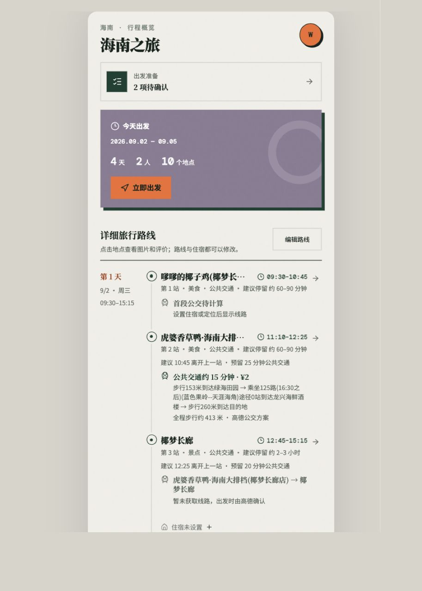
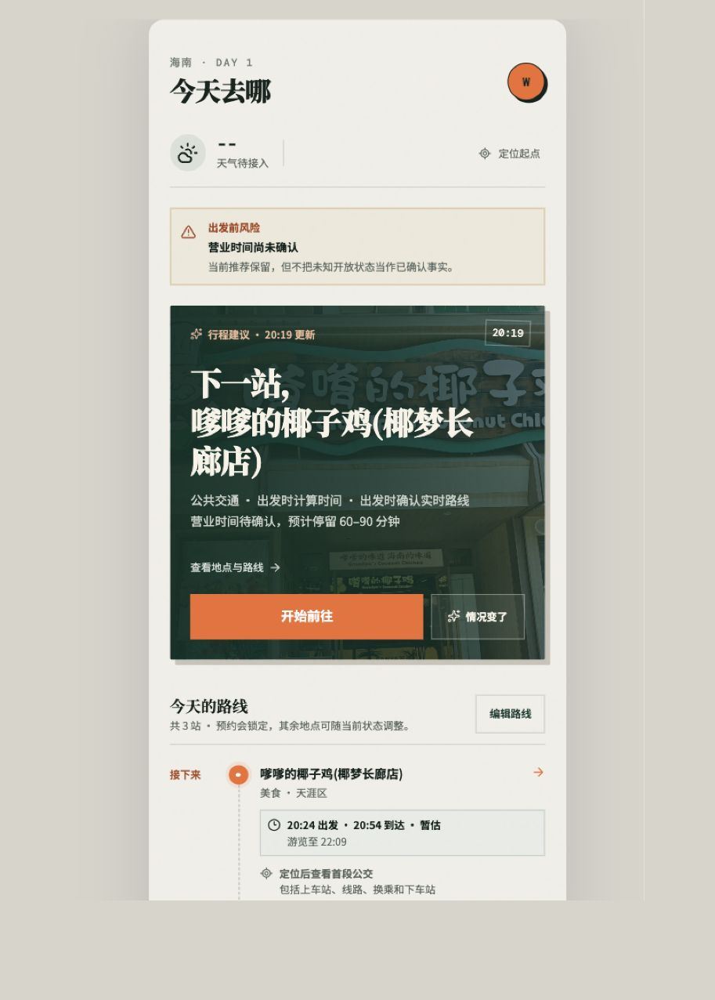
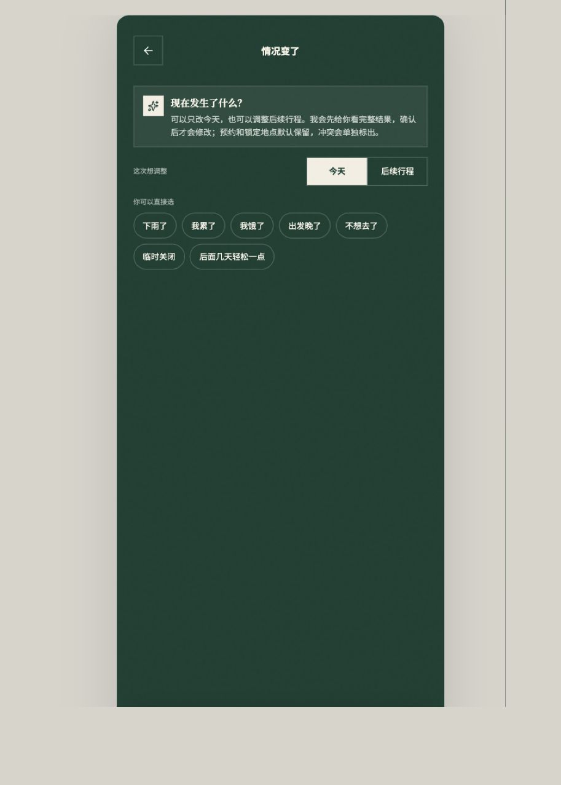
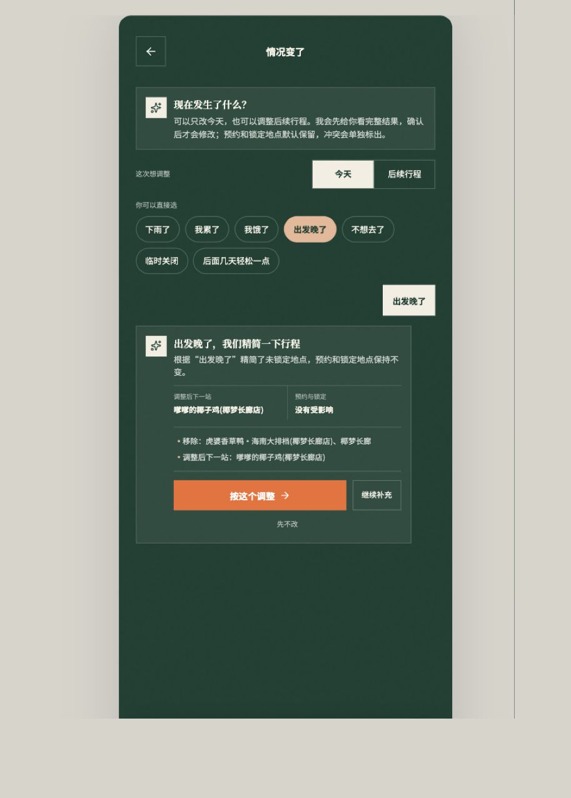
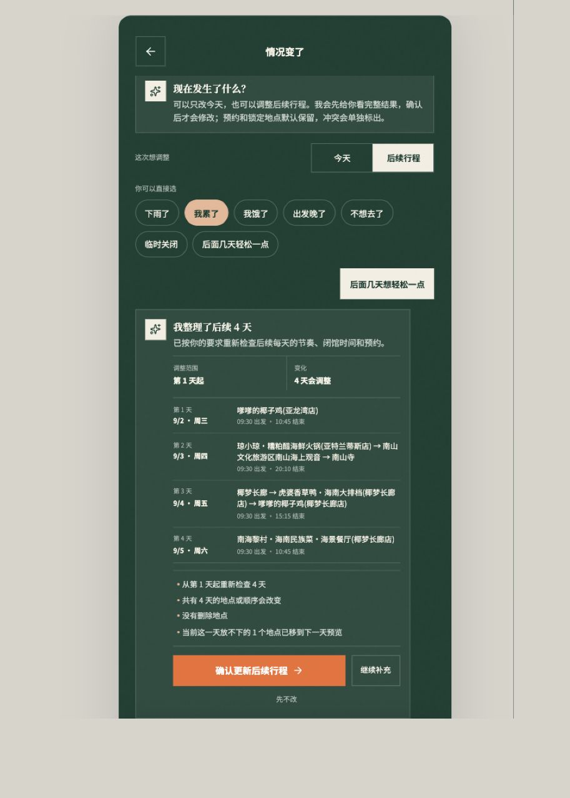
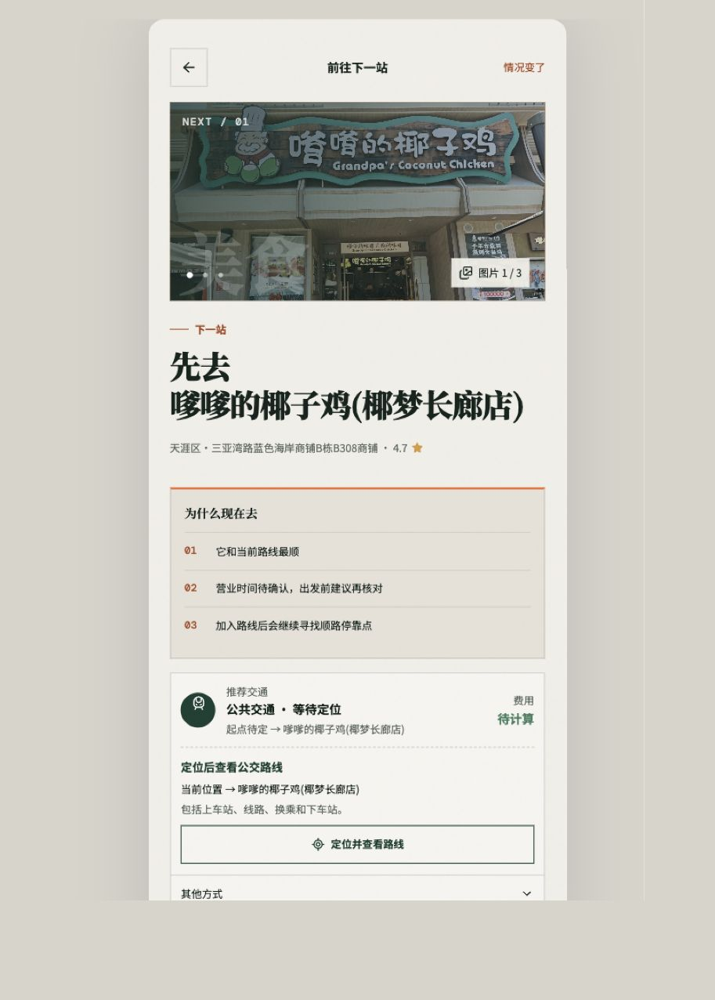
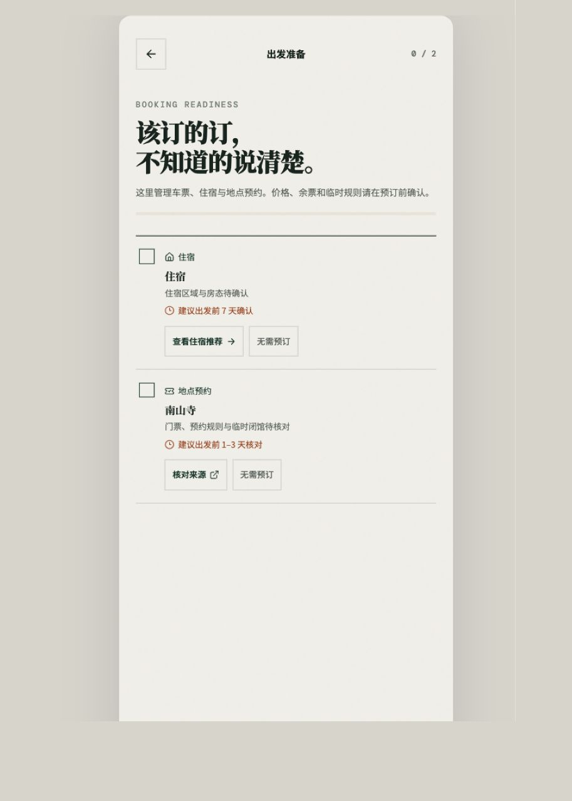
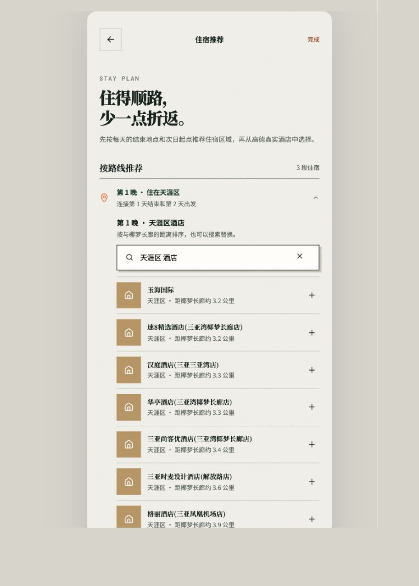
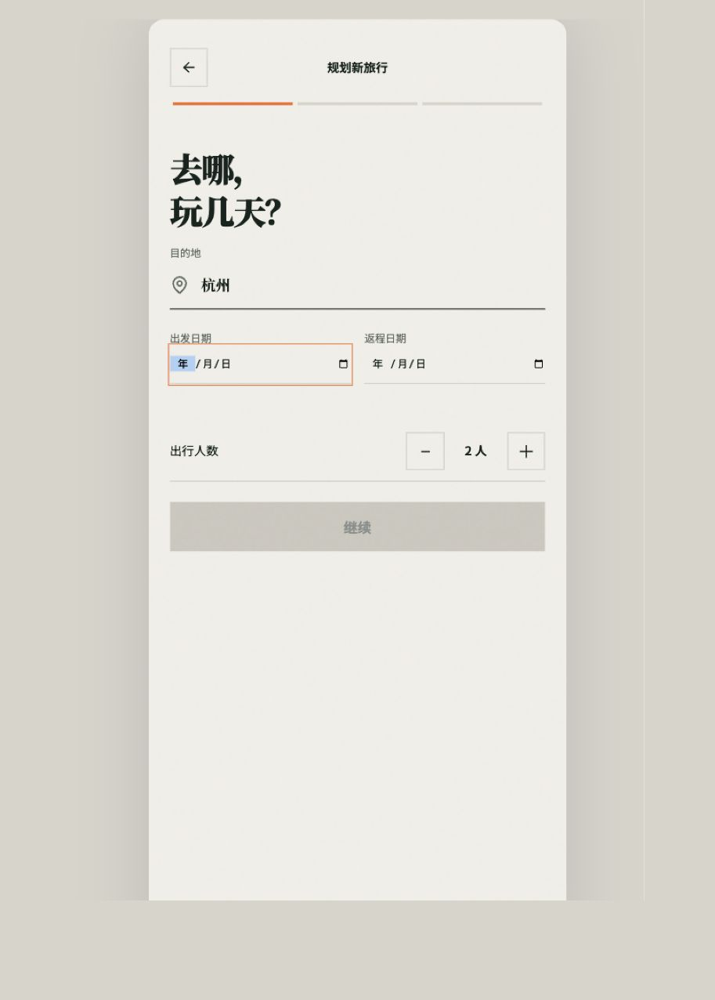
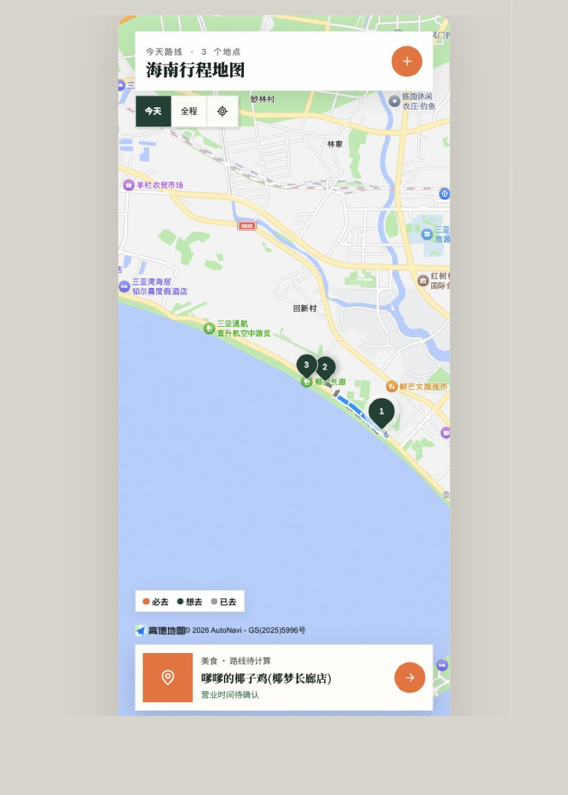

# 真实旅行用户 MVP 体验审计

审计时间：2026-09-02 20:18–20:22（Asia/Shanghai）

## 结论

当前版本已经形成了完整产品骨架：建行程、看今日路线、查看地点与交通、处理临时变化、预览整段调整、管理预约与住宿、地图浏览都能连起来。它适合继续做封闭测试，但还不适合让真实用户把一趟重要旅行交给它。最大问题不是界面，而是“时间已经来不及、数据尚未确认、跨天调整会连锁影响其他安排”时，产品仍允许用户继续执行或确认。

## 流程检查

### 1. 行程概览 — 需要改进

- 优点：待确认事项、出发状态、总天数和路线集中在一个入口；信息结构清楚。
- 风险：审计时已是 20:18，页面仍显示“今天出发”和“立即出发”，而第 1 天原计划 09:30–15:15 已全部过去。
- 风险：当天包含两个非常相似的餐厅，路线质量缺少类别、用餐时段和重复门店控制。

### 2. 今日执行 — 高风险

- 优点：把“下一站”放在最高层级，并能标出后续地点“当天时间不足”。
- 高风险：首站预计 20:54 到达、游览至 22:09，营业时间仍未知，但主按钮仍是“开始前往”。风险提示没有阻断不可靠行动。
- 建议：先给出“今天已无法按原计划完成”的决策卡，再让用户选择只保留一个、删除或进入跨天调整。

### 3. 临时变化入口 — 良好

- 优点：能区分“今天”和“后续行程”，明确说明确认前不修改，方向正确。
- 问题：快捷原因与调整范围是两套并列控件，但没有即时解释不同范围会影响什么；“临时关闭”也缺少指定地点的步骤。

### 4. 今日调整预览 — 需要改进

- 优点：先预览、后确认；清楚列出移除地点，且显示预约和锁定是否受影响。
- 风险：在营业时间、位置和实时交通均未确认时，仍把一个餐厅保留为下一站；“继续补充”与输入框关系不够明确。
- 建议：预览必须同时展示“为什么可行”、预计到达/结束时间和仍待确认的数据。

### 5. 整段行程预览 — 高风险

- 优点：能预览所有受影响日期，并在确认前显示“4 天会调整”。
- 高风险：用户要求“后面几天轻松一点”，结果仍从当天第 1 天开始安排 09:30 的过去时段，第 2 天仍排到 20:10；生成结果没有真正满足时间与“轻松”的客观约束。
- 高风险：只显示新行程，没有逐项展示原计划、新计划、移动原因，以及住宿、预约、门票和跨城交通的连锁影响。

### 6. 地点与交通决策 — 高风险

- 优点：真实地点、图片、地址、评分和来源说明提升了透明度。
- 高风险：没有当前位置、没有公交方案、营业时间未知，却仍写“它和当前路线最顺”并允许开始前往；证据与结论互相矛盾。
- 文案问题：“加入路线后会继续寻找”出现在已加入路线的地点上；“站内继续”含义不清。

### 7. 出发准备 — 高风险

- 优点：把住宿和地点预约放到统一清单，并允许标记“无需预订”。
- 高风险：旅行当天仍提示“建议出发前 7 天确认”和“出发前 1–3 天核对”，没有变成“已逾期、现在处理”。
- 缺口：没有最后核对时间、确认凭证、订单号、取消规则、联系人或真正的预订跳转。

### 8. 住宿推荐 — 需要改进

- 优点：按每晚对应路线推荐区域，比单独管理一个酒店更符合多日旅行。
- 风险：页面声称连接当天终点和次日起点，但排序只展示距当天终点的距离；无法判断第二天是否顺路。
- 缺口：缺少价格、评分、房型/房态、取消规则、入住时间、真实预订入口等选择所需信息。

### 9. 创建旅行 — 基础良好

- 优点：第一步只收目的地、日期和人数，负担低。
- 风险：出发地、抵达时间、返程时间会决定首尾两天是否可排，目前不是第一步的核心约束；泛目的地也缺少城市/区域消歧。

### 10. 行程地图 — 需要改进

- 优点：能在“今天/全程”之间切换，并同步选中地点。
- 风险：多个地点重叠时点位难辨；没有显示路线连线、移动方向、当前所在地到下一站的关系。
- 建议：默认自动适配路线范围，聚合重叠点位，并突出“我 → 下一站 → 后续站点”。

## 上线前优先级

1. **P0：建立不可违反的时间约束。** 过去时段、闭馆时间、预约时间、交通耗时、返程时间必须先于 AI 偏好；不满足就禁止给出“开始前往”。
2. **P0：跨天修改必须做影响预览。** 移动地点时重新校验每晚住宿、预约/门票、次日出发点、跨城交通，并逐项让用户确认。
3. **P1：把事实、估算和未知分开。** 没有位置不能说“最顺”，没有营业时间不能暗示可去；每个关键建议要显示依据与更新时间。
4. **P1：提高路线内容质量。** 做同店/同品牌/同类别去重、用餐时段约束、景点与休息平衡，并解释为何保留或舍弃。
5. **P1：让住宿和预约真正可执行。** 推荐需包含两段通勤、价格与评分等比较信息；待办需有逾期状态、凭证和核对入口。
6. **P1：保证弱网可用。** 从当前页面可推断天气、定位、路线和营业信息依赖在线服务；真实旅行至少要缓存当天路线、地址、预约凭证和应急联系方式。

## 可访问性风险与证据限制

- 多处次级文字约 12/较浅，照片上的白字和深绿色页面上的灰绿色文字存在对比度风险。
- 快捷标签和部分小图标的可触范围从截图无法完全确认；键盘顺序、屏幕阅读器、动态更新播报、200% 缩放与真机安全区需另测。
- 本次未授权真实定位，也未验证第三方预订、支付、真实导航、弱网/离线和系统权限拒绝状态。
