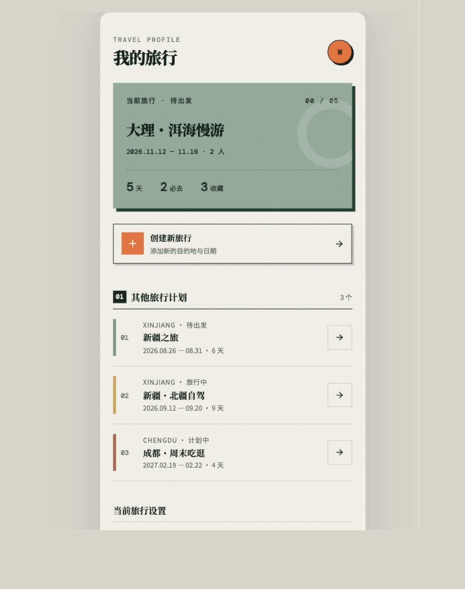
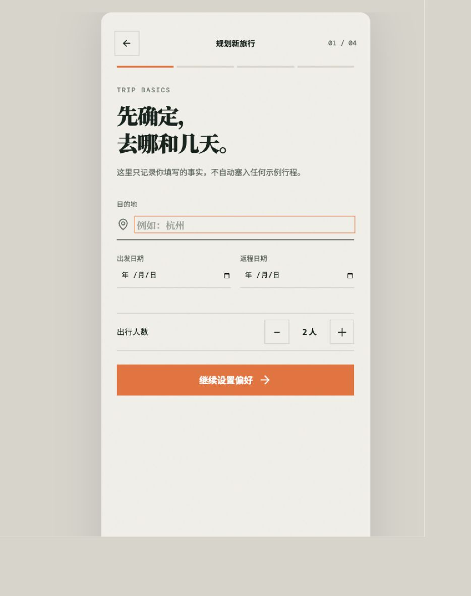
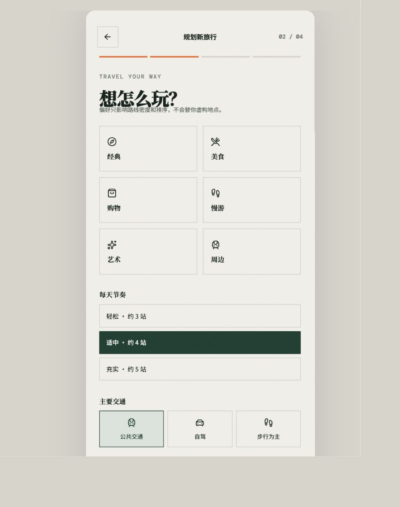
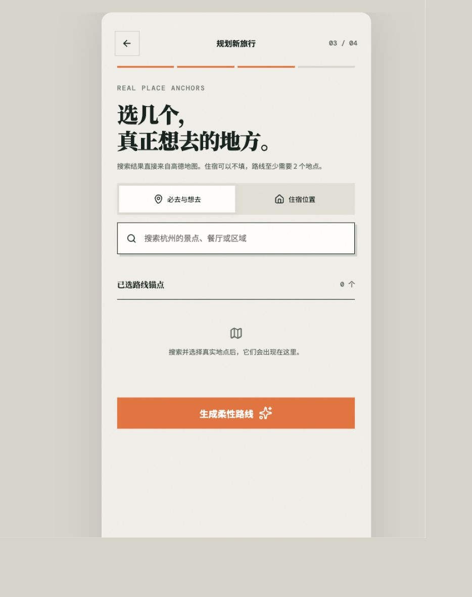
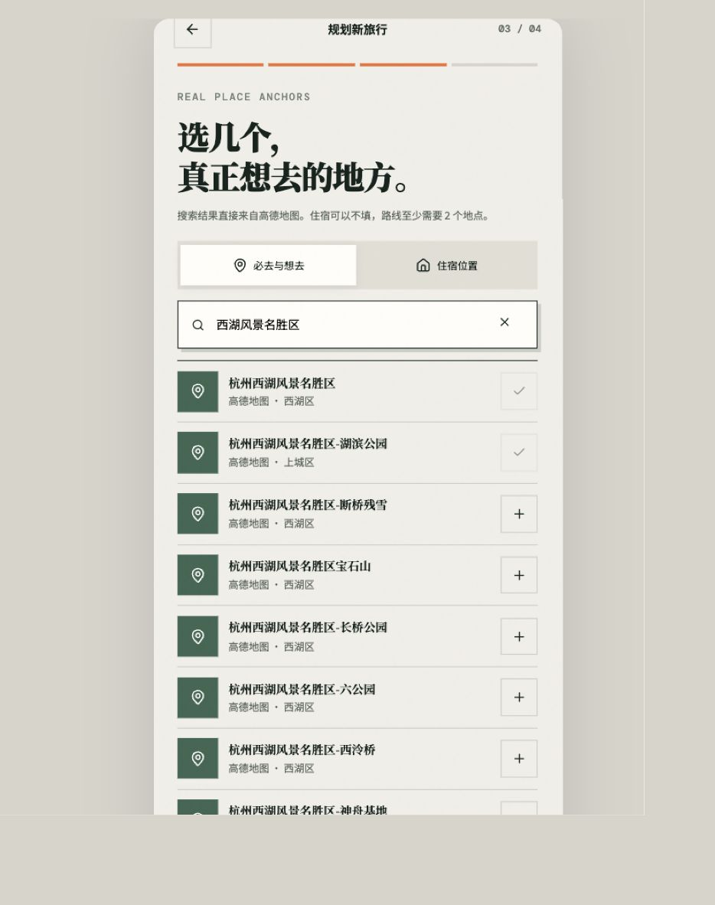
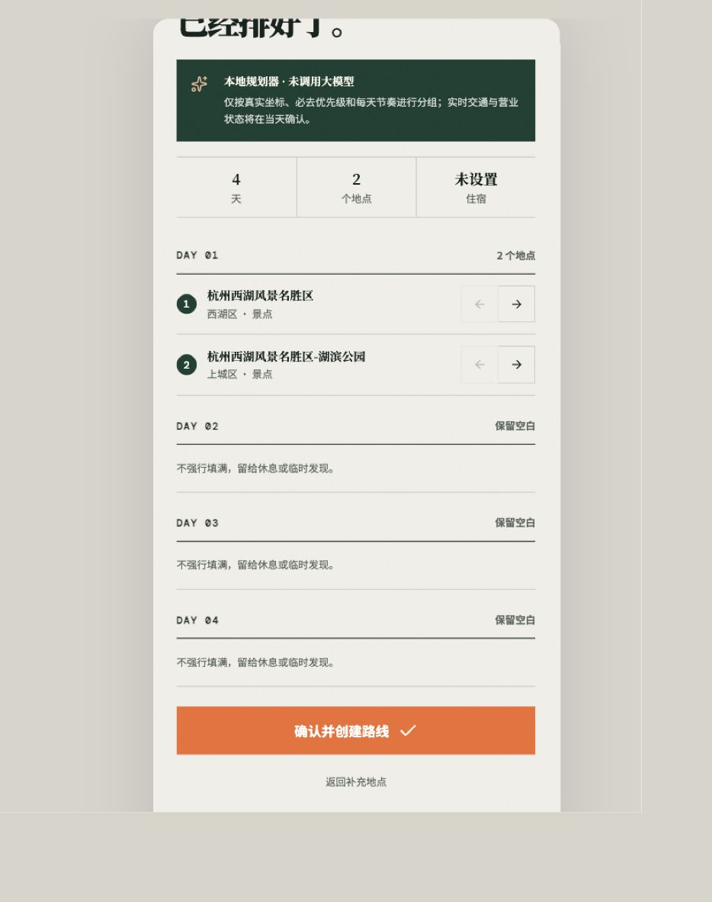

# 新建旅行流程审查

## 审查范围

- 目标：从已有旅行进入“创建新旅行”，完成基础信息、偏好、真实地点选择与路线确认。
- 核心原则：出发前轻规划、真实数据优先、减少选择负担、路线可编辑。
- 本次只审查，不修改产品代码。

## 流程证据

### 1. 入口 — 健康

- “创建新旅行”入口清晰，位于当前旅行卡片之后，视觉层级正确。
- 入口文案只提“目的地与日期”，没有说明这是“从零帮我规划”还是“我已有地点”，用户无法预判后续工作量。

### 2. 基础信息 — 基本健康

- 目的地、日期、人数是清晰的事实输入，符合不造数据的原则。
- “这里只记录事实”是在解释系统边界，不是在解释用户会得到什么；价值反馈出现得太晚。
- 必填项为空时主按钮仍保持高强调，状态上看不出能否继续。

### 3. 偏好设置 — 偏重

- 同一屏要求处理兴趣、每天节奏、主要交通三组决策，用户还没看到任何路线价值就已经连续做选择。
- 主按钮落在首屏之外；页面看起来像设置表单，不像 AI 帮用户减少规划工作。
- 节奏与交通都有默认值，但选中状态没有可读的 `aria-pressed`，辅助技术难以确认当前选择。

### 4. 地点选择 — 严重阻塞

- 这是当前最大的结构问题：流程名为“从零规划”，却要求用户自己知道地点名称，并至少搜索、选择两个地点。
- 这条链路实际服务的是“我已经看到想去的地方”，没有覆盖“我还没做攻略”的核心场景。
- 住宿与景点搜索并列在同一步，增加模式切换，但住宿并不是生成第一版路线的必要条件。

- 搜索返回大量近似名称，缺少地址、距离、类型差异等足够判断线索，选择成本高。
- 结果列表持续展开，把“已选锚点”和“生成路线”推到很远；用户选中地点后看不到累积结果和下一步。
- 必去、预约又在列表底部增加一轮逐项编辑，进一步放大操作成本。

### 5. 路线确认 — 严重阻塞

- 从长列表进入第四步时没有重置内容区滚动位置，页面直接停在路线中段，标题被截断；这是“流程不流畅”最直接的交互原因。
- 4 天只有 2 个地点，却全部放在 Day 1，另外 3 天为空，仍然使用“已经排好了”的完成语气，承诺与产出不匹配。
- “本地规划器 · 未调用大模型”是实现说明，不是用户价值，会削弱信任并打断行程审阅。
- 左右箭头只能跨天移动，缺少日期、区域主题和拖拽/重排语义，编辑动作难理解。

## 最重要的调整方向

1. 入口先分两条路径：“我还没做攻略”与“我已有想去地点”。当前搜索流程保留给第二条路径。
2. 从零路径压缩为三步：目的地与日期 → 一句话偏好/少量可选偏好 → 基于真实 POI 的分区路线提案。
3. 系统先给默认方案，用户只做删掉、必去、预约三类必要修正；住宿和交通放到可选补充区。
4. 地点选择页使用固定的已选摘要与底部主操作，选择后折叠或收起结果，不让列表把进度推走。
5. 每次步骤变化重置内容区到顶部；数据不足时不要宣称路线完成，而是提示补充地点或允许系统推荐真实地点。

## 无障碍与验证限制

- 截图可确认主要触控目标尺寸充足、文本对比总体清晰、步骤数字可见。
- 偏好与模式按钮的选中状态未暴露为可读语义，键盘和读屏体验需要补测。
- 本次未验证缩放、屏幕阅读器朗读顺序和完整键盘操作，不能据此判断整体 WCAG 合规。
